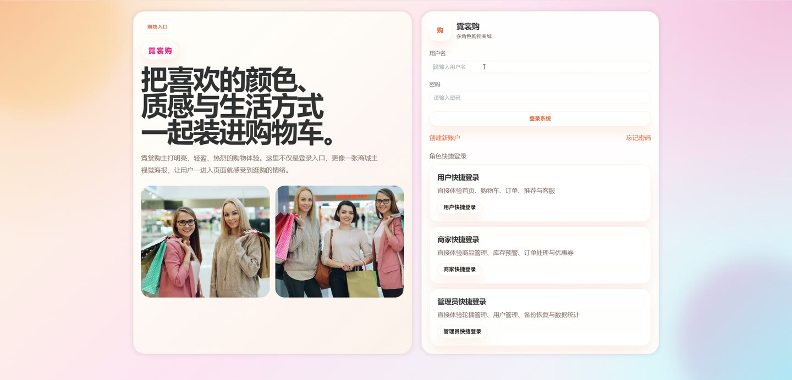
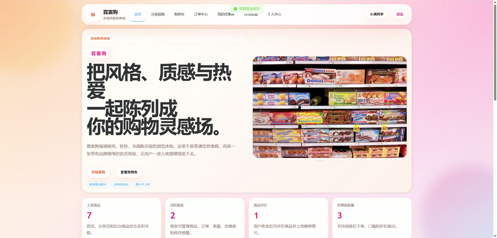
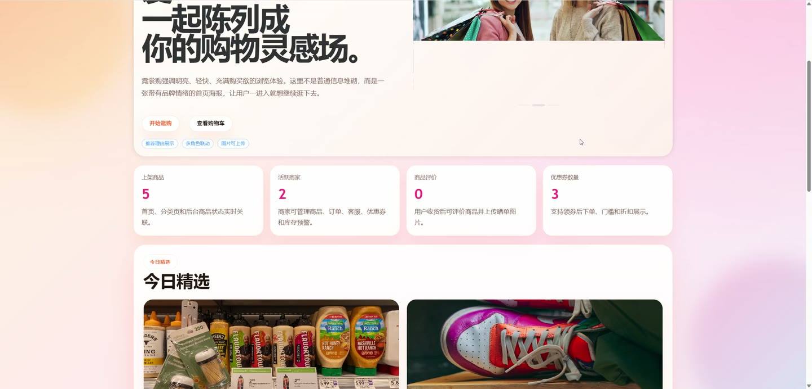
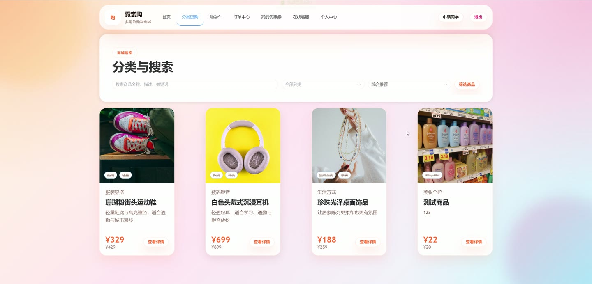
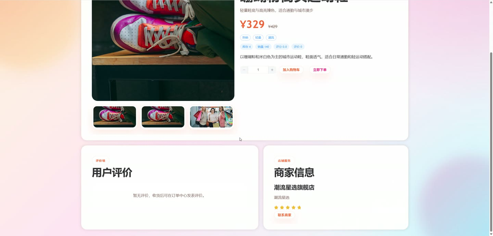
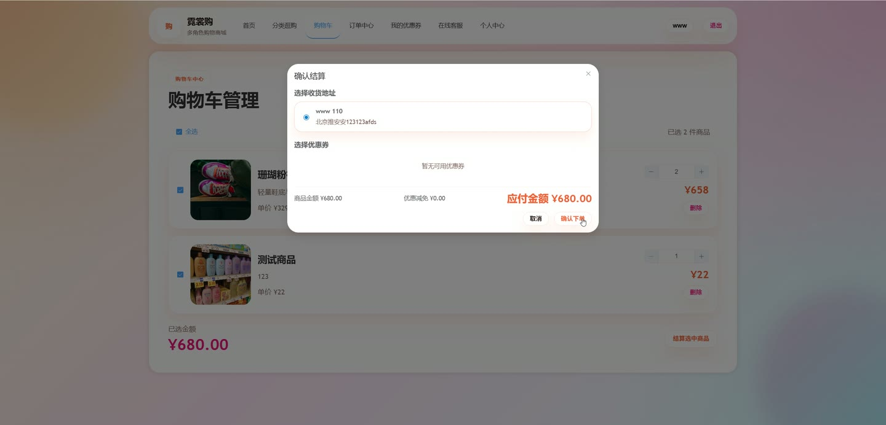

# (附文档)Python+Django+Vue3 购物商城

**技术栈**：Python、Django、Vue3、MySQL

### 系统简介

本系统是一套基于 Django + Vue3 的前后端分离购物商城平台，后端提供 REST 风格接口并内置 SPA 静态转发，前端采用 Vue3 单页应用按角色划分路由。系统包含普通用户、商家、管理员三类角色，覆盖商品浏览、购物车、下单支付、优惠券、评价、客服聊天、留言板、商家经营与平台治理等完整电商业务链路。
 
### 核心功能
 
### 普通用户端

 
- 首页聚合展示：获取轮播咨询、分类导航、精选推荐、最新上架、热销榜单及平台统计数量。 
- 商品浏览与搜索：支持关键词模糊匹配标题/副标题/描述，并按推荐、销量、价格升序、价格降序排序。 
- 商品详情查看：展示主图、图集、价格、原价、库存、运费、标签、商家店铺信息、评价均分与评价列表。 
- 行为埋点：浏览商品、搜索关键词时自动写入 UserBehavior 记录，用于后续推荐理由生成。 
- 个性化推荐：依据最近一次浏览或搜索行为，返回同分类或同关键词商品并附带推荐理由文案。 
- 账号注册登录：支持注册（可选用户/商家角色）、账号密码登录、角色快捷登录、凭用户名与邮箱重置密码。 
- 个人中心：查看与编辑昵称、邮箱、手机号、头像、性别、简介、联系地址等资料。 
- 收货地址管理：新增、修改、删除地址，设置默认地址，字段含收件人、电话、省市区与详细地址。 
- 购物车管理：加入购物车、修改数量、删除条目、全选/单选、实时计算已选金额与条目小计。 
- 结算下单：选择收货地址与可用优惠券，支持沙箱、余额、微信、支付宝支付方式，提交后生成订单。 
- 订单管理：查看订单列表与详情，执行支付、取消、确认收货、申请退款等操作，查看物流公司与单号。 
- 优惠券中心：领取平台或商家优惠券，查看我的优惠券及未使用、已使用、已过期状态。 
- 商品评价：对已完成订单条目提交评分、文字与图片评价，支持匿名评价，可修改或删除自己的评价。 
- 在线客服聊天：与商家建立会话，发送文本、贴纸、图片消息，查看历史消息与未读状态。 
- 留言板：向商家提交带主题的留言，查看商家回复内容与待回复/已回复状态。
 
### 商家端

 
- 经营看板：查看店铺商品数、订单数、销售额、库存预警与最新订单等汇总数据。 
- 商品管理：新增、编辑、删除商品，维护标题、副标题、描述、主图、图集、价格、原价、运费与标签。 
- 库存维护：设置库存数量与预警库存，标记首页推荐商品，切换草稿、上架、下架状态。 
- 订单处理：查看本店订单列表与明细，执行发货操作并填写物流公司与物流单号。 
- 退款处理：对申请退款的订单执行同意退款或驳回退款操作。 
- 优惠券管理：创建满减或折扣券，设置面额、使用门槛、库存、生效与失效时间及启用状态。 
- 客服会话：查看与用户的聊天会话列表，回复用户消息并维护最新消息与时间。 
- 留言板回复：查看用户留言，填写回复内容并更新留言状态为已回复。 
- 店铺资料：维护店铺名称、店铺标语、评分与联系地址等信息。
 
### 管理员端

 
- 管理看板：展示用户、商家、商品、订单总量，聚合库存预警商品与跨商家最新订单。 
- 用户管理：新增、编辑、删除用户，设置角色为用户/商家/管理员，维护邮箱、手机号、地址与店铺信息。 
- 用户状态控制：对指定用户执行禁用或启用，禁用后该账号无法登录系统。 
- 商品管理：跨商家查看全平台商品，新增、编辑、删除商品，执行上架与下架操作。 
- 订单管理：查看全平台订单，执行核实付款、发货、同意退款、驳回退款等操作。 
- 咨询管理：新增、编辑、删除首页展示的轮播咨询，维护标题、副标题、图片与排序。 
- 数据备份：一键备份当前数据库并下载备份文件，查看历史备份记录列表。 
- 数据恢复：选择备份记录执行恢复操作。 
- 数据统计：查看角色分布、订单状态分布、分类销售分析（商品数与销量）与商家经营分析（商品数、订单数、销售额）。 
- 操作日志：系统自动记录注册、后台操作等行为，含操作人、角色快照、动作、目标类型与目标 ID。
 
### 技术栈

 后端框架Python + Django（类视图与函数视图混用，csrf_exempt 处理 JSON 接口） ORMDjango ORM，含聚合 Avg/Count/Sum、Q 查询与 select_related 关联查询 权限控制基于 X-User-Id 请求头识别用户，require_role 校验 customer/merchant/admin 角色 前端框架Vue3（组合式 API，script setup） UI 组件库Element Plus（表单、表格、卡片、弹窗、消息提示等） 路由与状态Vue Router（含路由守卫与角色重定向）、session 状态模块 构建工具Vite 数据库MySQL 文件存储本地媒体目录，支持图片上传接口与静态资源转发
 
### 交付内容

 
- 后端完整源码 
- 前端完整源码 
- 数据库初始化脚本 
- 万字文档

## 界面展示

---

## 获取完整源码 + 万字文档

本仓库为项目介绍页。**完整前后端源码、数据库初始化脚本、万字项目文档**，请加微信 `kangkangcode`，或访问 [codekk.top](http://codekk.top) 获取。

可作课程设计 / 毕业设计参考，支持远程部署调试。